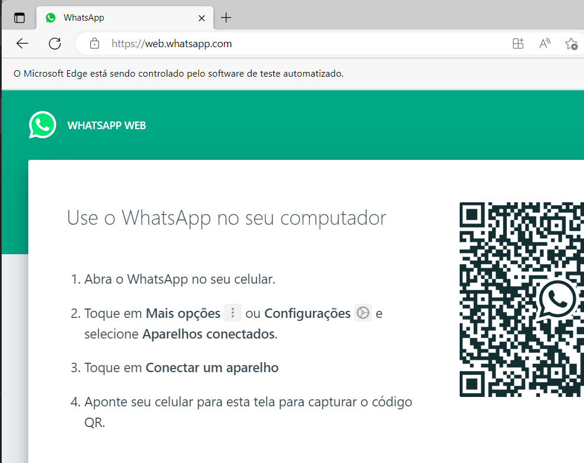

# <b>Chat de atendimento automático - WhatsApp</b>
Este é um projeto que visa criar um chat de atendimento automático para delivery ou entrega de conteúdo de marketing digital. Usando API além de ser integrado com as linguagens PHP e Python, com a ajuda das bibliotecas Selenium e Requests.<br><br>

## <b>Indíce</b>
- [O que é o sistema?](#o-que-é-este-sistema)
- [Funcionalidades](#funcionalidades)
- [Requisitos do Sistema](#requisitos-do-sistema)
- [Instalação e Uso](#configurações)
    - [Python](#python)
    - [WebDriver](#webdriver)
    - [XIAMPP](#xampp)

- [Importações](#importações)

- [Funcionamento do sistema](#funcionamento-do-sistema)
    - [Abrindo o WhatsApp](#abrindo-o-whatsapp)
    - [Identificando uma nova mensagem](#identificando-uma-nova-mensagem)
    - [Recuperando informações do cliente](#recuperando-informações-do-cliente)
    - [Recuperar a mensagem](#recuperar-a-mensagem)
    - [Exibindo mensagem de boas-vindas](#exibindo-mensagem-de-boas-vindas)
    - [Responder a mensagem](#responder-a-mensagem)
    - [Retornando ao contato pardão](#retornando-ao-contato-padrão)
    - [Buscando novas mensagens](#buscando-novas-mensagens)

- [Histórico de Alterações](#histórico-de-alterações)

- [FAQ](#faq)

- [Contribuindo](#contribuindo)

- [Créditos](#créditos)

- [Licença](#licença)
<br><br>

## <b>O que é este sistema?</b>
Este sistema é um assistente que permite enviar mensagens no WhatsApp usando Python, PHP e MySQL.<br>

## <b>Funcionalidades</b>
- Envio de mensagens automaticas para o WhatsApp.
- Utilização de PHP e Python Selenium.
- Entrega de conteúdo e atendimento para delivery ou marketing digital.

## Requisitos  do Sistema
- Python 3.9
- WebDriver
- XAMPP
- Bibliotecas Python: Selenium e Requests
- Ter uma conta no WhatsApp


## <b>Instalação e Uso</b><br>

Para instalar e usar o Chat de Atendimento Automático, siga os passos abaixo:

<n>1. Instale o Python versão 3.9 e os requisitos necessários na sua máquina: 

#### <b>Python</b>
Para rodar o sistema você deverá instalar a versão 3.9 do Python e as seguintes bibliotecas:<br>
```python
pip install selenium
pip install requests
```

<n>2. Instale o WebDriver e adicione o caminho do arquivo a pasta PATH:

#### <b>WebDriver</b>
Instale o WebDriver de sua preferência conforme o navegador qyue você está utilizando. No meu caso foi o  Microsoft Edge Driver(recomendável a versão Beta independente do navegador que você irá utilizar): [Microsoft Edge Driver](https://developer.microsoft.com/en-us/microsoft-edge/tools/webdriver//)<br>

1. Instale o driver compativel com a versão do seu navegador e sistema operacional do seu computador.<br>

2. Extraia o arquivo baixado para uma pasta de seu computador. <br>

3. Adicione a pasta onde o Microsoft Edge Driver foi extraído ao PATH do sistema.<br>

4. Para testar a instalação do Microsoft Edge Driver, abra o prompt de comando e execute o seguinte comando:<br>
    ```prompt
    edge_driver --version
    ```

<n>3. Instale o [XAMPP](https://www.apachefriends.org/pt_br/download.html) um software que contém alguns componentes do servidor web que serão extremamente úteis para o funcionamento do sistema. Serão utilizados servidores como, Apache e MySQL, veja o exemplo:
#### <b>XAMPP</b>
Depois de fazer a instalação, sempre que utilizar o programa ative o Apache e o MySQL.<br>
<n><br>

Ativando você terá acesso ao phpMyAdmin(banco de dados), digite este endereço em seu navegador:<br>
<br>

Esta será a interface do phpMyAdimin:<br>
<br>

Crie as tabelas conforme o código principal:<br>
<br>

Nesta imagem vemos a tabela 'histórico' criada, um exemplo de como funciona o banco de dados, a forma que ele interage com o usuário e o sistema:<br>
<br>
Coluna 'cliente1' é as mensagens do usuário.<br>
Coluna 'bot' é as mensagens do sistema.
## <b>Importações</b>

<br>

```python
from selenium import webdriver
from selenium.webdriver.common.keys import Keys
from selenium.webdriver.common.by import By
import requests
```
<br>


## <b>Funcionamento do Sistema</b>

### Abrindo o WhatsApp
Para começar a utilizar o atendimento automático, é necessário abrir o site do WhatsApp e capturar o QR Code para ter acesso à sua conta.<br><br>
<n><br>


### Identificando uma nova mensagem
Caso haja uma nova mensagem, o sistema identifica que ela não foi visualizada e clica na conversa para abri-la. Isso é indicado por um círculo verde de notificação.<br><br>
<n><br>

### Recuperando informações do cliente
Ao receber uma mensagem, o atendimento automático recupera o nome do contato que a enviou e exibe no terminal.<br><br>
<n><br>

### Recuperando a mensagem
Também é possível recuperar a última mensagem enviada pelo cliente e exibi-la no terminal.<br><br>
<n>

### Exibindo mensagem de boas-vindas

<n> No código abaixo, o bot vai enviar uma mensagem de boas vindas. Após isso, ele começará a interagir com o robô, através dos números passados no menu em PHP.<br><br>
```php
<?php
$menu = """
Olá, obrigado por entrar em contato com a Pizzaria GitHub.
Já vamos começar seu atendimento.
Escolha a opção de sua prefêrencia.
----------------Pizza---------------
*1* - Pizza de mussarela --- R$20,00
*2*- Pizza de calabresa --- R$20,00""";
?>
```

### Responder a mensagem<br>
As respostas são realizadas internamente por meio do PHP e do MySQL, interagindo com o Python e a biblioteca Requests, que se comunica com o servidor por meio do verbo HTTP GET. Isso permite que o atendimento automático responda às mensagens recebidas pelo cliente.<br><br>
<n>


### Retornando ao contato padrão
Voltar para o contato padrão fixado ao topo(uma conversa com você mesmo). Para fazer isso basta mandar uma mensagem para o seu próprio numero de telefone.<br>
<n>


### Buscando novas mensagens<br>
Por fim, o atendimento automático entra em loop e busca por novas mensagens enviadas pelo cliente.<br>
<n>


## <b>Contribuindo</b>

Se você quiser contribuir para este projeto, aqui estão algumas sugestões de como você pode ajudar:

- Reportar bugs e problemas
- Fazer sugestões de novas funcionalidades
- Melhorar a documentação
- Escrever testes
- Corrigir erros de digitação

Para contribuir, basta abrir uma issue descrevendo sua sugestão ou problema. Se você quiser fazer uma alteração, faça um fork do repositório, crie um novo branch para suas alterações e envie um pull request. Todas as contribuições são bem-vindas e apreciadas!

## <b>Histórico de Alterações</b>
### Versão 1.0.0 (2022/12/2022)
- Funcionalidade adicionada: Nenhuma alteração realizada.

## <b>FAQ</b>
<b>P: Como faço para instalar o sistema?</b><br>
R: Você precisa seguir os passos descritos na seção de Instalação e Uso do README.md.

<b>P: O que eu preciso para executar o sistema?</b><br>
R: Você precisa ter o Python, o WebDriver e o XAMPP instalados em seu computador. Todas as informações necessárias para instalação e uso estão disponíveis no README.md.

<b>P: O sistema funciona em sistemas operacionais diferentes do Windows?</b><br>
R: Sim, o sistema foi testado em sistemas operacionais Windows, MacOS e Linux.

## <b>Créditos</b>
Este projeto foi inspirado no Instrutor Victor Souza disponível em [Edita Código](https://editacodigo.com.br/index/), que foi adaptado para atender às necessidades deste projeto.

## <b>Licença</b>
Este projeto está licenciado sob a licença MIT. Veja o arquivo [LICENCE](LICENCE) para mais informações.